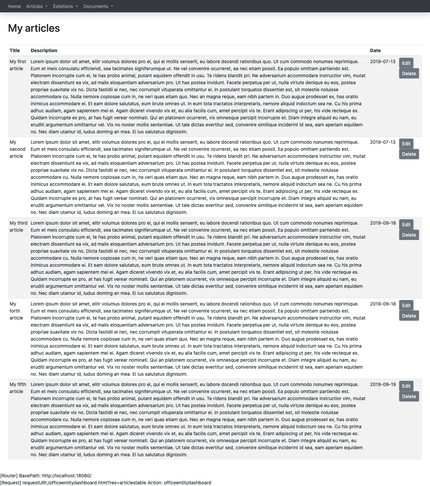

## Description

{:class="aside-image"}

A table is a structure that allows the developer to make a query and show to the user the results.
Eventually the table is going to contain links that allows the user to access to different specific features in the system linked to a specific entity shown in the table.

## Information needed in order to set up a table

### Get parameters

Sometimes we need to pass to the query behind the table some parameter using a get request. 

Example: www.example.com/mytable?parentid=2302

In order to catch that get parameter you need to add an object in the parameters section. That object has tree properties:

* type: the type (long, string, etc..) expected the parameter to take after validation
* validation: the rules the parameter has to follow
* name: the parameter name in the URL


"parameters": [
  { "type":"long", "validation":"required|numeric", "name":"parentid" }
]

If you want to know about the <a href="{{site.baseurl}}/docs/validation">Validation</a> check out the related page.

### Query

We need to make a query to the datase in order to populate our table.
The simplest thing to do is just to write the query in plain SQL and eventually connect the parameters needed from the GET section.


"query": {
  "sql": "select id, typeid, name, description FROM mytable WHERE parentid = :parentid;",
  "parameters":[
    { "type":"long", "placeholder": ":parentid", "getparameter": "parentid" }
  ]
}


As you can see the SQL parameter is inserted in the query using a placeholder: *:parametername*
The SQL parameter is connected to the GET parameter using: "getparameter": "parentid"
We can insert as many paremeters as we need.

If you want to know more about SQL paramenters check out the <a href="{{site.baseurl}}/docs/query">Query</a> page.

### Table Structure

The table structure is pretty easy.

We give a title to the table.

We describe a set of buttons, at the top of the table linked to specific actions. This can be useful for instance in order to link a form to create a new entity.

We describe a set of fields giving to each of them a name and a connection to the SQL query: *{"headline": "Name", "sqlfield": "name"}*

We describe a set of <a href="{{site.baseurl}}/docs/actions">actions</a> liked to each item of the table.


"table": {
  "title": "My table",
  "topactions": [
    { "label": "New", "resource": "newentityform"] }
  ]
  "fields": [
    {"headline": "Name", "sqlfield": "name"},
    {"headline": "Description", "sqlfield": "description"}
  ],
  "actions": [
    { "icon":"level-down", "label": "Info", "resource": "entityinfo", "parameters":[{"name": "id", "sqlfield": "id"}] },
    { "label": "Edit", "resource": "editentityform", "parameters":[{"name": "id", "sqlfield": "id"}] }
  ]
}


## A complete example

Combining all the described information in a unique file we obtain something like this:


{
  "name": "articlestable",
  "metadata": { "type":"table", "version": "1" },
  "allowedgroups": [ "author" ],
  "get": {
    "request": {
      "parameters": []
    },
    "query": {
      "sql": "SELECT id, title, description, tag, directory created FROM articles;",
      "parameters":[]
    },
    "table": {
      "title": "My articles",
      "topactions": [
        { "label": "New", "resource": "newarticle" }
      ],
      "fields": [
        {"headline": "Title", "sqlfield": "title"},
        {"headline": "Description", "sqlfield": "description"},
        {"headline": "Date", "sqlfield": "created"},
        {"headline": "Ctegorization", "composite":"${tag} ${directory}", "parameters": [
          { "name":"${tag}", "sqlfield": "tag"  },
          { "name":"${directory}", "sqlfield": "directory"  }
        ] },
      ],
      "actions": [
        {"label": "Edit", "resource": "editarticleform", "parameters":[{"name": "id", "sqlfield": "id"}] },
        {"label": "Delete", "resource": "deletearticletransaction", "parameters":[{"name": "id", "sqlfield": "id"}] }
      ]
    }
  }
}


This table script is taken from <a href="{{site.baseurl}}/tutorials/crud">the CRUD tutorial</a>. It is possible to <a href="https://github.com/fabiomattei/ud-demo">download a copy of the complete example from the GitHub repository</a>.
