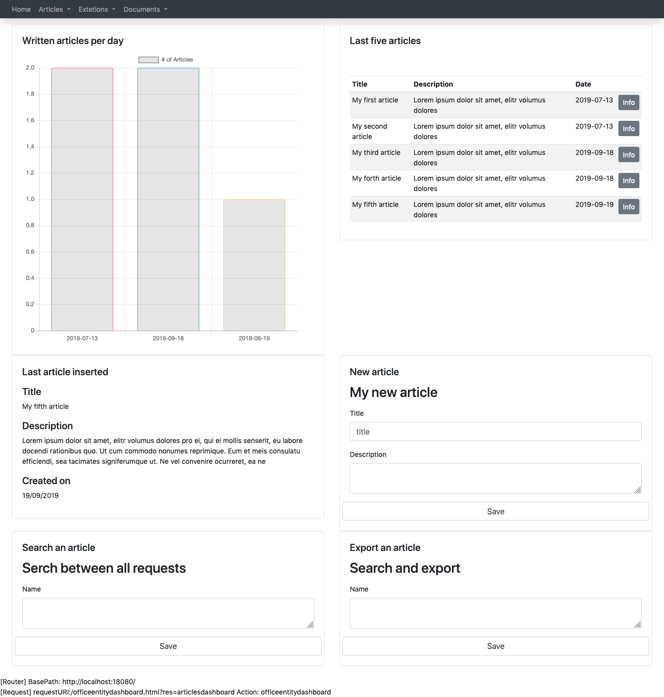

{:class="aside-image"}

A dashboard is a container of <a href="{{site.baseurl}}/docs/resource">resources</a> that allows the programmer to compose a page using different panels described in different <a href="{{site.baseurl}}/docs/resource">resources</a>.
The page is designed using bootstrap framework and for each resource we need to specify the row where we want to put it and how many columns we want the resource to take. We need to specify that using the **row** and **width** attributes.

A dashboard contains a json list of **panels**.

For each panel we need to specify:

* title: it is going to be shown in the interface
* resource: the identifier of the json resource in the system
* row: which row contains the specific panel
* width: how many columns we want the panel to extend

We do not need to provide parameter to this specific resource as the GET parameters are calculated recoursively from the contained resources. We expect the action that link this dashboard to provide all parameters required by all resources contained in it.

If you put a resource that defines a POST section, like a form or a search panel, that resource will work perfectly even inside the dashboard. As you can see there is a form titled "New article" in this dashboard, **The user can fill the form** and when he clicks the save button the trasnsaction, that is part of the post section, is executed, the article is inserted in the database and the dashboard is called again with a GET redirection.

You can use a dashboard in order to oraganize a page that is composed by more than a resource. 

### Complete example


{ 
  "name": "articlesdashboard",
  "metadata": { "type":"dashboard", "version": "1" },
  "allowedgroups": [ "author" ],
  "title":"Manager dashboard",
  "panels":[
    { "title":"My chart", "resource":"articleschartv1", "row":"1", "width":"6" },
    { "title":"Last five articles", "resource":"smallarticlestable", "row":"1", "width":"6" },
    { "title":"Last article inserted", "resource":"lastarticleinfov1", "row":"2", "width":"6" },
    { "title":"New article", "resource":"newarticleform", "row":"2", "width":"6" },
    { "title":"Search an article", "resource":"articlesearchv1", "row":"3", "width":"6" },
    { "title":"Export an article", "resource":"articleexportv1", "row":"3", "width":"6" }
  ]
}


This dashboard script is taken from <a href="{{site.baseurl}}/tutorials/crud">the CRUD tutorial</a>. It is possible to <a href="https://github.com/fabiomattei/ud-demo">download a copy of the complete example from the GitHub repository</a>.
