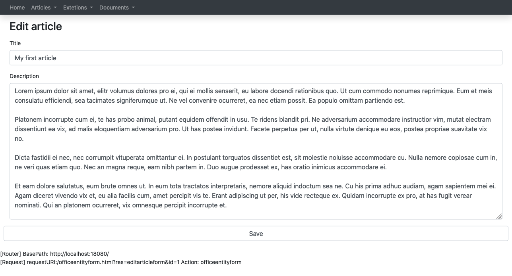

{:class="aside-image"}

## Structure

A form resource allows the programmer to insert a form in an application. 
A form is a complex structure. A form often need to be filled in advance with data coming from the database.
Then it send POST data through a POST request and after that some logic is executed in order to update the 
system.

## GET section 

### Request

Sometimes we need to pass some parameter to a query that feels the form.

Example: parentId = 2302


"parameters": [
  { "type":"integer", "validation":"required|integer", "name":"parentId" }
]

If you want to know about the <a href="{{site.baseurl}}/docs/validation">Validation</a> check out the related page.

### Query

Oftentimes we need to pre-feel the form with some data that comes from the database in order to allow the user to edit that data.
In order to do that we need to write a query.
We can write the query in plain SQL and eventually connect the paratameters needed to get paramenters.


"query": {
  "sql": "select id, typeid, name, description FROM mytable WHERE parentid = :parentid;",
  "parameters":[
    { "type":"long", "placeholder": ":parentid", "getparameter": "parentId" }
  ]
}


As you can see the SQL parameter is inserted in the query using a placeholder: *:parametername*
The SQL parameter is connected to the GET parameter using: "getparameter": "parentid"
We can insert as many paremeters as we need.

It is possible to send to the query a session parameter using: "sessionparameter": "sessionparametername"

It is possible to send to the query a constant parameter using: "constantparameter": "constantvalue"

If you want to know more about SQL paramenters check out the <a href="{{site.baseurl}}/docs/query">Query</a> page.

### Form


"form": {
  "title": "",
  "fields": [
    { "type":"textarea", "name":"name", "label":"Name", "placeholder":"Name", "sqlfield":"name", "width":"6", "row":"1" },
    { "type":"currency", "name":"amount", "label":"Amount", "placeholder":"10.0", "sqlfield":"amount", "width":"6", "row":"1" },
    { "type":"date", "name":"duedate", "label":"Due date", "sqlfield":"duedate", "width":"12", "row":"2" },
    { "type":"sqldropdown", "name":"consequenceid", "label":"Consequence", "sqlfield":"c_name", "width":"6", "row":"2",
      "query": {
        "sql": "SELECT c_id, c_name FROM consequences;",
        "parameters":[]
      },
      "valuesqlfield": "c_id",
      "labelsqlfield": "c_name"
    },
    { "type":"dropdown", "name":"environmental", "label":"Impact Environmental", "sqlfield":"r_environmental", "width":"6", "row":"4", "options": [
      { "value": "0", "label":"(Not set)" },
      { "value": "1", "label":"1: No contamination; Localised Effects; Potential breach of license/permit" },
      { "value": "2", "label":"2: Contained contamination; Localised Effects; Breach of license/permit" },
      { "value": "3", "label":"3: Low contamination; Localised effects of short duration; Limited impact to water/land/air" },
      { "value": "4", "label":"4: Medium contamination; Widespread effects of extended duration; Significant impact to water/land/air" },
      { "value": "5", "label":"5: Heavy contamination; Effects of extended duration; Potentially resulting in temporary or permanent shutdown" }
      ]
    },
    { "type":"hidden", "name":"unitassetid", "getparameter":"assetid", "row":"4" },
	{ "type":"submitbutton", "width":"2", "row":"4", "name": "Go", "constantparameter": "Go" },
  ]
}


The properties of the **field** object are:

* label: the descriptive text associated to the field the user can read
* type: the type of the field [textfield, numeric, textarea, currency, date, dropdown, sqldropdown, hidden, submitbutton]
* name: html name attrbute associated to the field
* placeholder: html placeholder attrbute associated to the field
* sqlfield: used in case we need to load data in a field that comes from a query
* sessionparameter: used in case we need to load data in a field that comes from a session parameter
* getparameter: used in case we need to load data in a field that comes from a getparameter parameter
* postparameter: used in case we need to load data in a field that comes from a postparameter parameter
* constantparameter: used in case we need to load data in a field that comes from a constantparameter parameter
* width: the width of the field in bootstrap terms
* row: the row number where the field is located in bootstrap terms
* options: used in case of dropdown field a list of possible option objects Ex: { "value": "0", "label":"(Not set)" }
* query: used by sqldropdown
* valuesqlfield: used by sqldropdown
* labelsqlfield: used by sqldropdown

## POST section

### Request

What a form usually does is to pass POST parameters using a POST request and then to process that parameters
We need to give a description of the post parameters and of the validation we need to apply to them.


"request": {
  "postparameters": [
    { "name":"name", "validation":"required|max_len,250" },
    { "name":"plantcode", "validation":"max_len,250" },
    { "name":"description", "validation":"alpha_numeric" },
    { "name":"condition", "validation":"alpha_numeric" },
    { "name":"competentperson", "validation":"alpha_numeric" },
    { "name":"comment", "validation":"alpha_numeric" },
    { "name":"unitassetid", "validation":"required|integer" },
    { "name":"technicalassetid", "validation":"required|integer" }
  ]
}


If you want to know more about the <a href="{{site.baseurl}}/docs/validation">Validation</a> check out the related page.

### Transactions

The trasactions list contains a set of query objects that change the status of the database.
A commit is set in order to make all changes permanent only if all queries succeed.


"transactions": [
  {
    "sql":"UPDATE unitasset SET ua_competentperson = :competentperson, ua_conditionsummary = :condition, ua_identifier = :plantcode, ua_description= :description, ua_comment = :comment WHERE ua_id=:unitassetid;",
    "parameters":[
      { "type":"string", "placeholder": ":competentperson", "postparameter": "competentperson" },
      { "type":"string", "placeholder": ":condition", "postparameter": "condition" },
      { "type":"string", "placeholder": ":plantcode", "postparameter": "plantcode" },
      { "type":"string", "placeholder": ":description", "postparameter": "description" },
      { "type":"string", "placeholder": ":comment", "postparameter": "comment" },
      { "type":"long", "placeholder": ":unitassetid", "postparameter": "unitassetid" }
    ]
  },
  {
    "sql":"UPDATE asset SET ta_name = :name WHERE ta_id=:technicalassetid;",
    "parameters":[
      { "type":"string", "placeholder": ":name", "postparameter": "name" },
      { "type":"long", "placeholder": ":technicalassetid", "postparameter": "technicalassetid" }
    ]
  }
]


As you can see the SQL parameter is inserted in the query using a placeholder: *:parametername*
The SQL parameter is connected to the GET parameter using: "postparameter": "parentid"
We can insert as many paremeters as we need.

It is possible to send to the query a session parameter using: "sessionparameter": "sessionparametername"

It is possible to send to the query a constant parameter using: "constantparameter": "constantvalue"

### Notifications

TODO

## Complete example


{
  "name": "sampleform",
  "metadata": { "type":"form", "version": "1" },
  "allowedgroups": [ "administrationgroup", "teachergroup", "managergroup" ],
  "get": {
    "request": {
      "parameters": [
        { "type":"long", "validation":"required|numeric", "name":"assetid" }
      ]
    },
    "query": {
      "sql": "SELECT ua_id, ua_competentperson, ua_conditionsummary, ua_identifier, ua_description, ua_comment, ta_id, ta_parentid, ta_name FROM unitasset U JOIN asset a on U.ua_assetid = a.ta_id WHERE ua_id = :id;",
      "parameters":[
        { "type":"long", "placeholder": ":id", "getparameter": "assetid" }
      ]
    },
    "form": {
      "title": "My new article",
      "action": { "resource":"sampleform" },
      "method": "POST",
      "fields": [
        { "type":"textfield", "name":"name", "label":"Name", "placeholder":"Name", "readonly":"readonly", "sqlfield":"ta_name", "width":"6", "row":"1" },
        { "type":"textfield", "name":"plantcode", "label":"Plant Code", "placeholder":"Plant Code", "sqlfield":"ua_identifier", "width":"6", "row":"1" },
        { "type":"textarea", "name":"description", "label":"Description", "placeholder":"Description", "sqlfield":"ua_description", "width":"12", "row":"2" },
        { "type":"textfield", "name":"condition", "label":"Condition", "placeholder":"Condition", "sqlfield":"ua_conditionsummary", "width":"6", "row":"3" },
        { "type":"textfield", "name":"competentperson", "label":"Competent person", "placeholder":"Competent person", "sqlfield":"ua_competentperson", "width":"6", "row":"3" },
        { "type":"textarea", "name":"comment", "label":"Comment", "placeholder":"Comment", "sqlfield":"ua_comment", "width":"12", "row":"4" },
        { "type":"hidden", "name":"unitassetid", "sqlfield":"ua_id", "row":"4" },
        { "type":"hidden", "name":"technicalassetid", "sqlfield":"ta_id", "row":"4" },
		{ "type": "submitbutton", "width":"2", "row":"5", "name": "Save", "constantparameter": "Save" }
      ]
    }
  },
  "post": {
    "request": {
      "postparameters": [
        { "name":"name", "validation":"required|max_len,250" },
        { "name":"plantcode", "validation":"max_len,250" },
        { "name":"description", "validation":"alpha_numeric" },
        { "name":"condition", "validation":"alpha_numeric" },
        { "name":"competentperson", "validation":"alpha_numeric" },
        { "name":"comment", "validation":"alpha_numeric" },
        { "name":"unitassetid", "validation":"required|integer" },
        { "name":"technicalassetid", "validation":"required|integer" }
      ]
    },
    "transactions": [
      {
        "sql":"UPDATE unitasset SET ua_competentperson = :competentperson, ua_conditionsummary = :condition, ua_identifier = :plantcode, ua_description= :description, ua_comment = :comment WHERE ua_id=:unitassetid;",
        "parameters":[
          { "type":"string", "placeholder": ":competentperson", "postparameter": "competentperson" },
          { "type":"string", "placeholder": ":condition", "postparameter": "condition" },
          { "type":"string", "placeholder": ":plantcode", "postparameter": "plantcode" },
          { "type":"string", "placeholder": ":description", "postparameter": "description" },
          { "type":"string", "placeholder": ":comment", "postparameter": "comment" },
          { "type":"long", "placeholder": ":unitassetid", "postparameter": "unitassetid" }
        ]
      },
      {
        "sql":"UPDATE asset SET ta_name = :name WHERE ta_id=:technicalassetid;",
        "parameters":[
          { "type":"string", "placeholder": ":name", "postparameter": "name" },
          { "type":"long", "placeholder": ":technicalassetid", "postparameter": "technicalassetid" }
        ]
      }
    ],
    "notifications": [
      {
        "body":":name sbuscribed to sky class :group",
        "type":"message",
        "parameters":[
          { "type":"string", "placeholder": ":name", "postparameter": "name" },
          { "type":"string", "placeholder": ":group", "postparameter": "groupname" }
        ],
        "destinationgroups": [ "administrationgroup", "teachergroup", "managergroup" ],
        "action": { "action":"documentinfo", "resource":"documentsubscriptionv1", "parameters":[{"name":"id", "value":"id"}] }
      },
	  {
        "body":":name sbuscribed to sky class :group",
        "type":"task",
        "parameters":[
          { "type":"string", "placeholder": ":name", "postparameter": "name" },
          { "type":"string", "placeholder": ":group", "postparameter": "groupname" }
        ],
        "destinationgroups": [ "administrationgroup", "teachergroup", "managergroup" ],
        "action": { "action":"documentinfo", "resource":"documentsubscriptionv1", "parameters":[{"name":"id", "value":"id"}] }
      }
    ],
    "redirect": {
      "action": { "resource": "finantialdashboard" }
    }
  }
}


