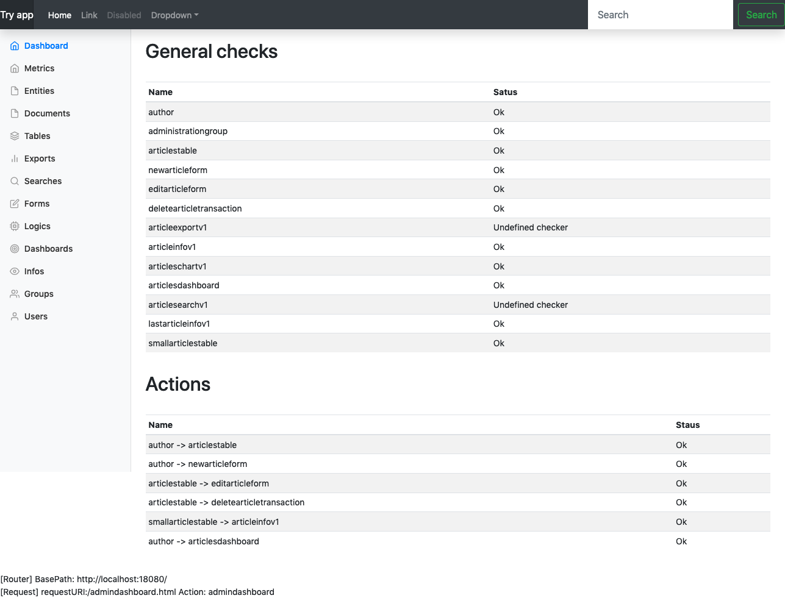

UD comes with a control panel that allows the DEVOP to have under control the whole application

You can access this panel pointing your browser to the login page and using 

* user: _admin_ 
* password: _admin_

The adminitrator panel helps the software administrato to:

* verify all json files are well structured, the system has some testing abilities
* check the properties of each resource
* manage users
* generate metrics for the defined resources (experimental)
* generate documentation for the defined resources (experimental)
