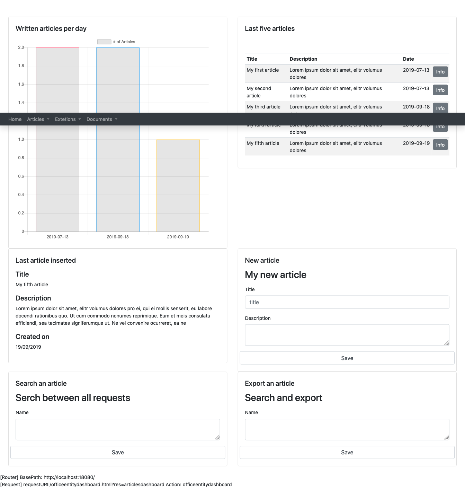

## Dashboard

Let's create a <a href="{{site.baseurl}}/docs/dashboard">dashboard</a> in order to help our administrator to work with articles in a smarter and quicker way.
Our dashboard is going to be made by 6 panels:

{:class="aside-image"}

* a chart that shows the articles written per day, in the last 5 days
* a table containing the last 5 written articles
* an info panel that shows the last inserted article
* a form to insert a new article
* a search panel for artciles
* an export to pdf panel for articles

Io order to achieve that all we need to do is to create a <a href="{{site.baseurl}}/docs/dashboard">dashboard</a> resource adding the a resource for each panel:

* articleschartv1
* smallarticlestable
* lastarticleinfov1
* newarticleform
* articlesearchv1
* articleexportv1

Each resource describe a panel that is going to be part of the <a href="{{site.baseurl}}/docs/dashboard">dashboard</a>. Each panel is located in a precise position we specfy in the dashboard using the row and width attributes.


{ 
  "name": "articlesdashboard",
  "metadata": { "type":"dashboard", "version": "1" },
  "allowedgroups": [ "author" ],
  "title":"Manager dashboard",
  "panels":[
    { "title":"My chart", "resource":"articleschartv1", "row":"1", "width":"6" },
    { "title":"Last five articles", "resource":"smallarticlestable", "row":"1", "width":"6" },
    { "title":"Last article inserted", "resource":"lastarticleinfov1", "row":"2", "width":"6" },
    { "title":"New article", "resource":"newarticleform", "row":"2", "width":"6" },
    { "title":"Search an article", "resource":"articlesearchv1", "row":"3", "width":"6" },
    { "title":"Export an article", "resource":"articleexportv1", "row":"3", "width":"6" }
  ]
}


## Chart: written articles per day 


{
  "name": "articleschartv1",
  "metadata": { "type":"chartjs", "version": "1" },
  "allowedgroups": [ "author" ],
  "get": {
    "request": {
      "parameters": []
    },
    "query": {
      "sql":"select count(id) counted, created FROM articles GROUP BY created;",
      "parameters":[]
    },
    "chartdataglue":[
      { "type":"array", "placeholder":"#labels", "sqlfield":"created" },
      { "type":"array", "placeholder":"#amounts", "sqlfield":"counted" }
    ],
    "chart": {
      "type":"bar",
      "data": {
        "labels": "#labels",
        "datasets": [{
          "label": "# of Articles",
          "data": "#amounts",
          "backgroundColor:":[
            "rgba(255, 99, 132, 0.2)",
            "rgba(54, 162, 235, 0.2)",
            "rgba(255, 206, 86, 0.2)",
            "rgba(75, 192, 192, 0.2)",
            "rgba(153, 102, 255, 0.2)",
            "rgba(255, 159, 64, 0.2)"
          ],
          "borderColor": [
            "rgba(255,99,132,1)",
            "rgba(54, 162, 235, 1)",
            "rgba(255, 206, 86, 1)",
            "rgba(75, 192, 192, 1)",
            "rgba(153, 102, 255, 1)",
            "rgba(255, 159, 64, 1)"
          ],
          "borderWidth": "1"
        }]
      },
      "options": {
        "scales": {
          "yAxes": [{
            "ticks": {
              "beginAtZero":true
            }
          }]
        }
      }
    }
  }
}


## Table: last 5 written articles


{
  "name": "lastarticleinfov1",
  "metadata": { "type":"info", "version": "1" },
  "allowedgroups": [ "author" ],
  "get": {
    "request": {
      "parameters": [
      ]
    },
    "query": {
      "sql":"select id, title, SUBSTRING(description, 1, 250) as descriptionshort, created FROM articles WHERE id=(SELECT MAX(id) FROM articles);",
      "parameters":[]
    },
    "info": {
      "title": "",
      "fields": [
        { "type":"textfield", "label":"Title", "value":"title", "width":"12", "row":"1" },
        { "type":"textarea", "label":"Description", "value":"descriptionshort", "width":"12", "row":"2" },
        { "type":"date", "label":"Created on", "value":"created", "width":"12", "row":"3" }
      ]
    }
  }
}


## Info: last inserted article


{
  "name": "lastarticleinfov1",
  "metadata": { "type":"info", "version": "1" },
  "allowedgroups": [ "author" ],
  "get": {
    "request": {
      "parameters": [
      ]
    },
    "query": {
      "sql":"select id, title, SUBSTRING(description, 1, 250) as descriptionshort, created FROM articles WHERE id=(SELECT MAX(id) FROM articles);",
      "parameters":[]
    },
    "info": {
      "title": "",
      "fields": [
        { "type":"textfield", "label":"Title", "value":"title", "width":"12", "row":"1" },
        { "type":"textarea", "label":"Description", "value":"descriptionshort", "width":"12", "row":"2" },
        { "type":"date", "label":"Created on", "value":"created", "width":"12", "row":"3" }
      ]
    }
  }
}


## Form: new article

This resource is the exact resource we described in the <a href="{{site.baseurl}}/tutorials/crud">CRUD tutorial</a>. We do not need to write it twice, we can use that resource wherever we want in different pages of the application.

## Search between articles


{
  "name": "articlesearchv1",
  "metadata": { "type":"search", "version": "1" },
  "allowedgroups": [ "author" ],
  "get": {
    "query": {
      "sql":"select id, title, description, created FROM articles ORDER BY id LIMIT 20;"
    },
    "table": {
      "title": "My table",
      "fields": [
        { "headline": "Name", "sqlfield":"name" },
        { "headline": "Amount", "sqlfield":"amount" },
        { "headline": "Due date", "sqlfield":"duedate" }
      ],
      "actions": [
        { "lable":"Edit", "action":"entityform", "resource":"formrequestv1", "parameters":[{"name":"id", "sqlfield":"id"}] },
        { "lable":"Edit", "action":"entitydelete", "resource":"entitydelete", "parameters":[{"name":"id", "sqlfield":"id"}] }
      ]
    },
    "form": {
      "title": "Serch between all requests",
      "submitTitle": "Search",
      "fields": [
        { "type":"textarea", "validation":"max_len,2500", "name":"name", "label":"Name", "placeholder":"Name", "width":"12", "row":"1" },
        { "type": "submitbutton", "width":"2", "row":"3", "name": "Save", "constantparameter": "Save" }
      ]
    }
  },
  "post": {
    "table": {
      "title": "My articles",
      "fields": [
        {"headline": "Title", "sqlfield": "title"},
        {"headline": "Description", "sqlfield": "description"},
        {"headline": "Date", "sqlfield": "created"}
      ],
      "actions": [
        {"label": "Info", "action": "entityinfo", "resource": "articleinfov1", "parameters":[{"name": "id", "sqlfield": "id"}] }
      ]
    },
    "form": {
      "title": "Serch between all requests",
      "submitTitle": "Search",
      "fields": [
        { "type":"textarea", "validation":"max_len,2500", "name":"name", "label":"Name", "placeholder":"Name", "postparameter":"name", "width":"12", "row":"1" }
      ]
    },
    "query": {
      "sql":"select id, title, description, created FROM articles WHERE title=:name;",
      "parameters":[
        { "placeholder": ":name", "postparameter": "name" }
      ]
    }
  }
}


## PDF export for articles


{ 
  "name": "articleexportv1",
  "metadata": { "type":"export", "version": "1" },
  "documenttype":"pdf",
  "filename":"requests",
  "allowedgroups": [ "author" ],
  "get": {
    "form": {
      "title": "Search and export",
      "submitTitle": "Export",
      "fields": [
        { "type":"textarea", "validation":"max_len,2500", "name":"name", "label":"Name", "placeholder":"Name", "value":"name", "width":"12", "row":"1" },
        { "type": "submitbutton", "width":"2", "row":"3", "name": "Save", "constantparameter": "Save" }
      ]
    }
  },
  "post": {
    "query": {
      "sql":"select id, title, description, created FROM articles WHERE title=:name;",
      "parameters":[
        { "placeholder": ":name", "postparameter": "name" }
      ]
    },
    "table": {
      "title": "My table",
      "fields": [
        {"headline": "Title", "sqlfield": "title"},
        {"headline": "Description", "sqlfield": "description"},
        {"headline": "Date", "sqlfield": "created"}
      ]
    },
    "aggregation": [
      { "label":"Total amount", "operator": "+", "field":"amount" }
    ]
  }
}

