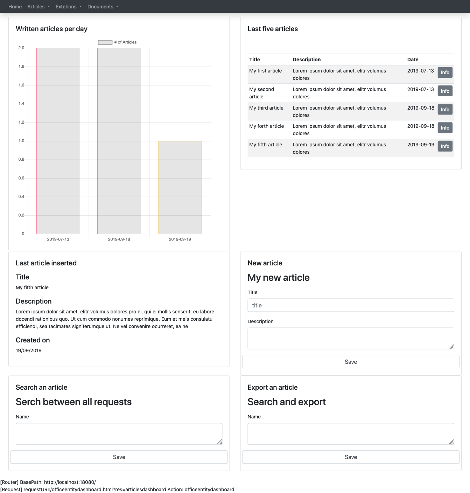

# Pushing things a little further

## Dashboard

Let's create a dashboard in order to help our administrator to work with articles in a smarter and quicker way.
Our dashboard is going to be made by 6 panels:

* a chart that shows the articles written per day, in the last 5 days
* a table containing the last 5 written articles
* an info panel that shows the last inserted article
* a form to insert a new article
* a search panel for artciles
* an export to pdf panel for articles

Io order to achieve that all we need to do is to create a <a href="{{site.baseurl}}/docs/dashboard">dashboard</a> resource adding the a resource for each panel:

* articleschartv1
* smallarticlestable
* lastarticleinfov1
* newarticleform
* articlesearchv1
* articleexportv1


{ 
  "name": "articlesdashboard",
  "metadata": { "type":"dashboard", "version": "1" },
  "allowedgroups": [ "author" ],
  "title":"Manager dashboard",
  "panels":[
    { "title":"My chart", "resource":"articleschartv1", "row":"1", "width":"6" },
    { "title":"Last five articles", "resource":"smallarticlestable", "row":"1", "width":"6" },
    { "title":"Last article inserted", "resource":"lastarticleinfov1", "row":"2", "width":"6" },
    { "title":"New article", "resource":"newarticleform", "row":"2", "width":"6" },
    { "title":"Search an article", "resource":"articlesearchv1", "row":"3", "width":"6" },
    { "title":"Export an article", "resource":"articleexportv1", "row":"3", "width":"6" }
  ]
}


## Written articles per day chart

